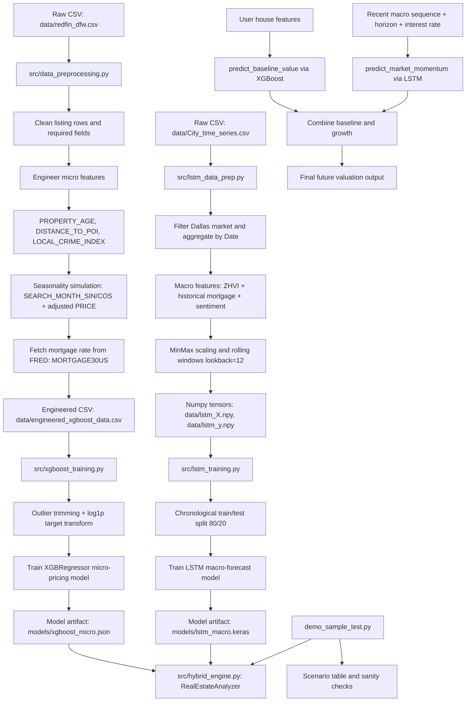

# Pipeline Summary: Raw Data to Hybrid Valuation

## Notes
- Micro model (XGBoost) estimates the present-day property baseline price from engineered listing features.
- Macro model (LSTM) estimates market momentum from historical Zillow trend plus macro signals.
- Hybrid engine multiplies baseline value by macro growth shift to produce future valuation.
